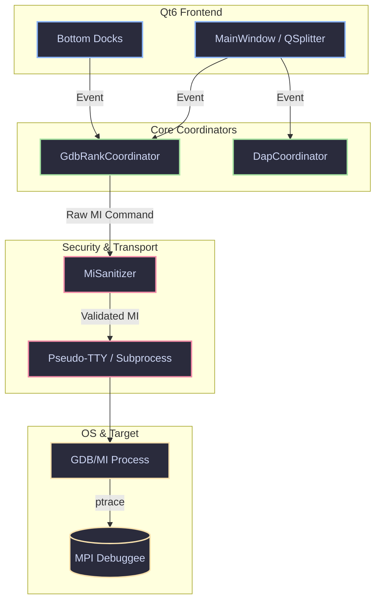

# 🛠️ GridLock Developer Documentation

Welcome to the internal architecture and developer documentation for **GridLock**. This repository contains the high-level design, build instructions, and subsystem overviews required to contribute to our Qt6/C++23 MPI debugger.

## 📚 Developer Index

| Subsystem | Description |
| :--- | :--- |
| 🏗️ [**Environment Setup & Build**](./environment_setup.md) | OS matrices, Meson/Ninja targets, and CQtDeployer packaging. |
| ⚙️ [**Backend Architecture Core**](./architecture_core.md) | GDB/DAP/LSP Coordinators, Zero-Copy Memory Engine, and Security. |
| 🖼️ [**UI Internals & Views**](./ui_internals.md) | Qt6 widgets, models, Wayland rendering, and theming. |
| 🧪 [**Testing & CI Pipelines**](./testing_and_ci.md) | Dockerized TDD sandbox, `SYS_PTRACE`, and unit test suite. |

---

## 🏛️ High-Level Architecture Overview

GridLock utilizes a heavily decoupled architecture where the pure Wayland Qt6 UI interacts with target MPI processes through sanitized, stateful coordinator abstractions. 

This decoupled approach ensures that UI events never directly spawn unsafe shell commands, and raw memory is always routed through boundary validators before being rendered.

---

> 🧑‍💻 **Users:** Looking for the end-user manual and interface guides? See the [**User Documentation**](../user/README.md).
