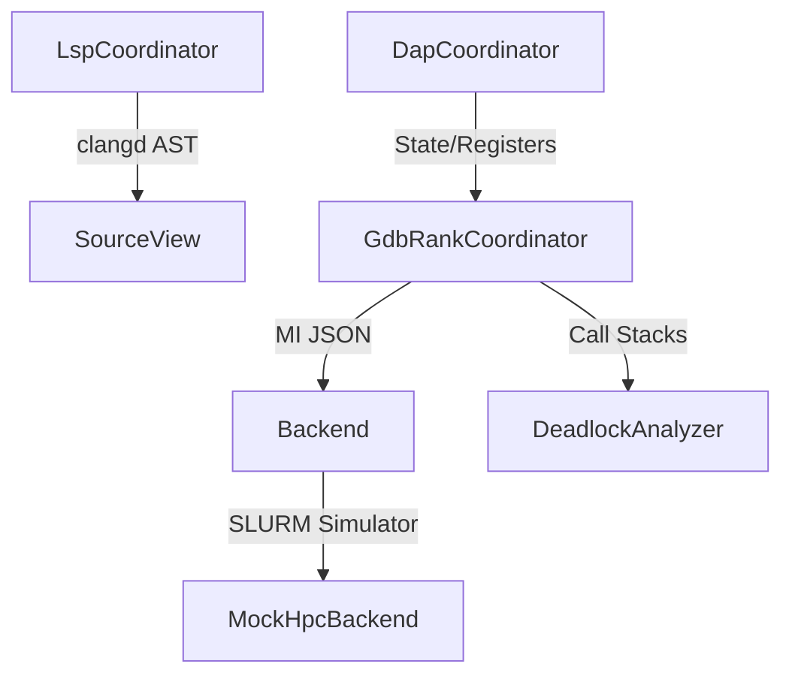

# HPC Orchestration and Memory Engine

This document details the core logic handling debug protocols, backend concurrency, cluster mock-ups, and raw zero-copy memory reads.

## 🔄 HPC Orchestration Loop

The Orchestration Loop bridges user interactions to active remote execution backends using stateful coordinators.



| Component | Files | Description |
| :--- | :--- | :--- |
| **GdbRankCoordinator** | `GdbRankCoordinator.hpp`, `GdbRankCoordinator.cpp` | Manages the subprocess pool for all MPI ranks, parsing GDB/MI responses into `QVariant` Maps. |
| **DapCoordinator** | `DapCoordinator.hpp`, `DapCoordinator.cpp` | Implements the Debug Adapter Protocol (DAP) over `stdin/stdout`, providing a standard interface for IDE state. |
| **LspCoordinator** | `LspCoordinator.hpp`, `LspCoordinator.cpp` | Spawns `clangd` locally to evaluate C++ hover states directly within the editor workspace scope. |
| **MockHpcBackend** | `MockHpcBackend.hpp`, `MockHpcBackend.cpp` | Synthesizes a local SLURM cluster environment to facilitate Headless TDD. |
| **DeadlockAnalyzer** | `DeadlockAnalyzer.hpp`, `DeadlockAnalyzer.cpp` | Parses incoming stack traces for `MPI_Wait` and `MPI_Barrier` holds to trigger the UI diagnostics graph. |

## ⚡ Zero-Copy Memory & Security Engine

Direct memory interaction is critical for handling massive matrices (e.g. 5GB fluid dynamics arrays). To maintain a responsive UI, memory syscalls are strictly dispatched to background threads using `QtConcurrent::run`, with results bridged back to the GUI via signals.

*Example: Background memory read emitting a signal in `DapCoordinator`:*
```cpp
// Executed upon receiving an 'evaluate' DAP response yielding a raw pointer address
(void)QtConcurrent::run([this, pid = m_rankToPid[req.rankId],
                         baseAddress, count = req.rows * req.cols,
                         rows = req.rows, cols = req.cols]() {
  try {
    // Perform blocking syscall in background thread
    std::vector<double> doubles = NativeMemoryReader::readDoubles(pid, baseAddress, count);
    
    // Safely emit to the main GUI thread (QueuedConnection automatically used across thread boundaries)
    emit heatmapDataReady(doubles, rows, cols);
  } catch (const std::exception &e) {
    qWarning() << "Heatmap memory read failed:" << e.what();
  }
});
```

| Component | Files | Description |
| :--- | :--- | :--- |
| **NativeMemoryReader** | `NativeMemoryReader.hpp`, `NativeMemoryReader.cpp` | Executes `process_vm_readv` syscalls directly into target memory to bypass `ptrace` latency. |
| **MemoryBoundsValidator** | `MemoryBoundsValidator.hpp`, `MemoryBoundsValidator.cpp` | Ensures target read limits remain within `.bss` and `.data` segments to prevent Segfaults. |
| **MemoryExporter** | `MemoryExporter.hpp`, `MemoryExporter.cpp` | Serializes massive raw bytes directly into flat CSV or binary blobs. |
| **MiSanitizer** | `MiSanitizer.hpp`, `MiSanitizer.cpp` | Filters incoming GDB/MI ASTs. Limits nesting to 32 and payload size to 64KB to prevent buffer overflows. |
| **TelemetryObfuscator** | `TelemetryObfuscator.hpp`, `TelemetryObfuscator.cpp` | Defends against side-channel analysis by ensuring network payloads use MTU padding and constant-time flushing. |
