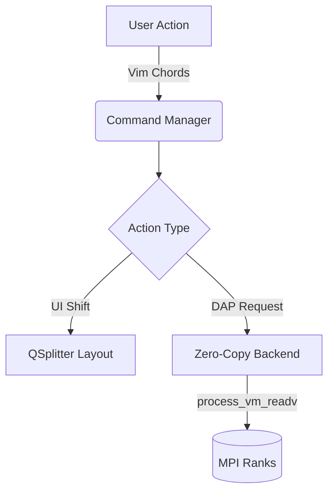

# ⚡️ GridLock User Documentation

Welcome to the official user documentation for **GridLock**, the next-generation Qt6/C++23 IDE designed specifically for High-Performance Computing (HPC) and MPI debugging.

## 🧭 Navigation

| Guide | Description |
|---|---|
| 🎨 [**Interface & Layout Guide**](./interface_guide.md) | Master the 3-column layout, bottom docks, and Vim-style shortcuts. |
| 🚀 [**Advanced Debugging**](./advanced_debugging.md) | Leverage the Deadlock Detector, FPE Trapper, Memory Exports, and more. |
| 🌐 [**HPC & Remote Workflows**](./hpc_workflows.md) | Configure SLURM, SSH keys, and Spack environments for cluster execution. |

---

## 🧠 Our Philosophy

GridLock was built from the ground up to solve the unique challenges of debugging massive parallel MPI applications, adhering to three core principles:

> **1. Wayland-Native**  
> We bypass X11 legacy overhead. GridLock uses pure Wayland to render dense data streams without tearing.

> **2. Zero-Copy Architecture**  
> Reading memory from 1,000 MPI ranks shouldn't freeze your IDE. We use `process_vm_readv` and shared memory to inspect debuggee state instantly, achieving zero-copy overhead. Features like the **Memory Diff Engine** rely on this to compare massive memory regions simultaneously across ranks.

> **3. Session Bookmarking**
> Don't lose track of your work across multi-day debugging marathons. GridLock natively serializes your active breakpoints, watched variables, and UI state into lightweight TOML workspaces.

> **4. Keyboard-Centric & Chorded**  
> Mouse travel is wasted time. GridLock implements a global Command Pattern with Vim-style chorded shortcuts, allowing you to manipulate windows, toggle breakpoints, and step through code without lifting your hands.



Jump into the [**Interface Guide**](./interface_guide.md) to get started!

## 🎓 Tutorial Mode (Experimental)

As of version `0.5.3`, GridLock includes an experimental, Work-In-Progress (WIP) interactive tutorial suite. This mode is designed for testing debugger integrations and demonstrating the IDE's core features (e.g., Deadlock Detection, Memory Diffing).

To launch the interactive tutorial:
```bash
./build/gridlock --tutorial-mode
```
*Note: This feature is currently in active development.*

---

> 👩‍💻 **Developers:** Looking to build or contribute to GridLock? See the [**Developer Documentation**](../developer/README.md).
