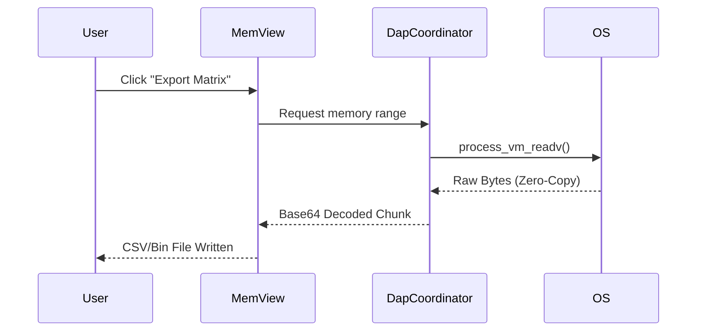

# 🚀 Power-User Manual: Advanced Debugging

GridLock provides specialized tools for diagnosing complex HPC anomalies, race conditions, and memory corruptions.

## 🛑 Deadlock Detector (Barrier/Wait Analyzer)

MPI deadlocks are notoriously difficult to track. GridLock's Deadlock Detector passively analyzes the call stacks of all ranks. 

If multiple ranks are stalled in `MPI_Wait`, `MPI_Barrier`, or `MPI_Bcast` for longer than the configured threshold, the **MpiDiagnosticsWidget** flashes red and provides a dependency graph showing exactly which rank is holding the resource.

## 💥 Floating-Point Exception (FPE) Trapper

Catching `NaN` or `Inf` at the exact moment of creation is critical in scientific computing.

1. Open the **MpiDiagnosticsWidget**.
2. Toggle the **Enable FPE Traps** switch.
3. GridLock will inject `#pragma` or environment-level signals (e.g., `FE_INVALID | FE_DIVBYZERO`) into the debuggee.
4. The IDE will halt execution on the exact instruction that generated the bad float, highlighting it in the `DisassemblyView`.

## 🚦 Conditional Breakpoints via Expressions

Don't pause every iteration of a billion-step loop. Use conditional breakpoints.

1. Press `Alt + B` to set a standard breakpoint.
2. Right-click the red gutter icon (or use the command palette).
3. Enter a GDB/MI valid expression (e.g., `i == 500000 && local_rank == 2`).
4. The breakpoint indicator will turn **blue**, signifying a condition is attached.

## 💾 Raw Memory Matrix Export

For machine learning or intensive data analysis, sometimes you need to dump raw memory directly to disk.

Using our zero-copy `process_vm_readv` backend, GridLock can dump massive memory ranges instantly:
1. Open the **MemView** dock.
2. Highlight a contiguous block of memory.
3. Click **Export Matrix...**
4. Choose **CSV** (for human-readable floats/doubles) or **Binary/Bin** (for pure raw bytes).

## ✨ Value-Change Visual Highlighting

Keep track of mutations without manual inspection. In both the **Variables Dock** and the **Registers Dock**:

*   When a value changes between execution steps, the cell briefly flashes **Yellow**.
*   This is powered by the `DifferentialGrid` signal-slot bridge, calculating diffs in real-time.
*   This highlighting works globally across all expanded structs and objects in the `Watch Expressions`.
