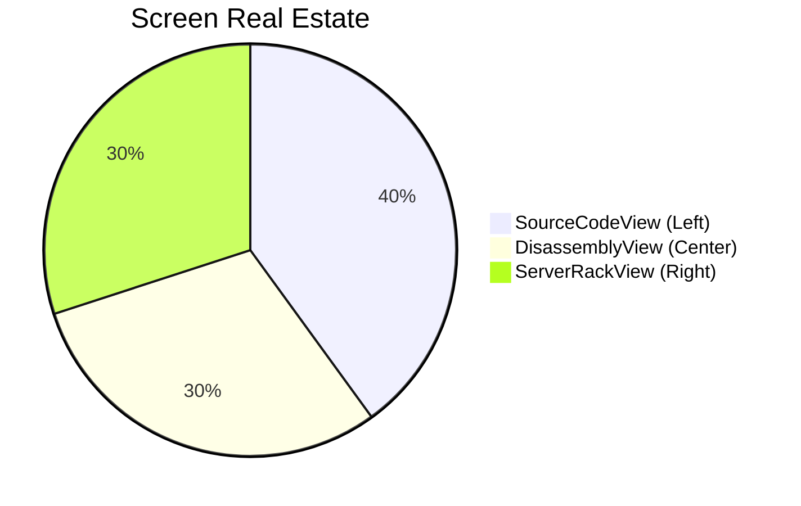

# 🎨 Interface & Layout Manual

GridLock's interface is designed for maximum data density and minimal context switching. It revolves around a primary **3-Column QSplitter Layout** and a comprehensive set of **Bottom Docks**.

## 📐 The 3-Column QSplitter Layout

GridLock partitions the main viewing area into three synchronized columns.

*   **Left Column: `SourceCodeView`**
    Your primary text editor. Features LSP-powered syntax highlighting, inline hover tooltips, and logical block-based breakpoint tracking to prevent execution drift.
*   **Center Column: `DisassemblyView`**
    A synchronized assembly view. As you step through C++ code on the left, the DisassemblyView highlights the corresponding machine instructions, crucial for vectorization and optimization analysis.
*   **Right Column: `ServerRackView`**
    A visual matrix of all active MPI ranks. Instantly see which ranks are running, paused, or crashed.

---

## 🗃️ Bottom Docks (`QTabWidget`)

The lower portion of the screen houses auxiliary tools in a tabbed interface.

| Dock | Functionality |
| :--- | :--- |
| **Terminal** | Standard interactive shell access. |
| **Watch Expressions** | Track specific variables across all or specific MPI ranks. |
| **Evaluator** | Execute ad-hoc GDB/MI expressions instantly. |
| **Reference Manual** | Integrated dual-mode Zeal/SQLite docsets and `man` pages. |
| **GDB Console** | Raw access to the underlying GDB instance with rank/text filtering. |
| **MemView** | Hex dumps and raw memory analysis via `process_vm_readv`. |
| **Registers** | Real-time CPU register state, synchronized with the execution line. |
| **HPC Console** | Management for SSH connections and cluster state. |
| **MpiDiagnosticsWidget**| High-level MPI communicator and topology breakdown. |

---

## ⌨️ Vim-Style Chorded Shortcuts

GridLock embraces a keyboard-centric philosophy using a global ShortcutManager.

| Chord / Shortcut | Action | Scope |
| :--- | :--- | :--- |
| `Alt + B` | Toggle Breakpoint at Cursor | `SourceCodeView` |
| `Ctrl + W`, `H` | Focus Left Split | Global |
| `Ctrl + W`, `L` | Focus Right Split | Global |
| `Ctrl + W`, `J` | Focus Bottom Docks | Global |
| `Ctrl + W`, `K` | Focus Top Split | Global |
| `F5` | Start / Continue Execution | Global |
| `F10` | Step Over | Global |
| `F11` | Step Into | Global |
| `Shift + F11` | Step Out | Global |
| `Alt + R` | Focus ServerRackView | Global |

> [!TIP]
> All shortcuts are intercepted globally but safely bypass input fields to ensure you never accidentally trigger a command while typing a variable name.

---

## 🎨 Customizing Appearance

GridLock uses a unified Material Design theming engine powered by `Qt-Advanced-Stylesheets`. 
To customize your visual experience, open the **Preferences** dialog (`Edit -> Preferences` or `Ctrl+Comma`) and navigate to the **Appearance** tab:

* **File Tree Density:** Choose between *Compact*, *Comfortable*, or *Large* layouts for the Project Explorer.
* **Colorize Icons:** Toggle this to enable/disable vibrant Nerd Font icons based on the Catppuccin Mocha color palette.

These settings are applied instantly upon saving without requiring an application restart.
