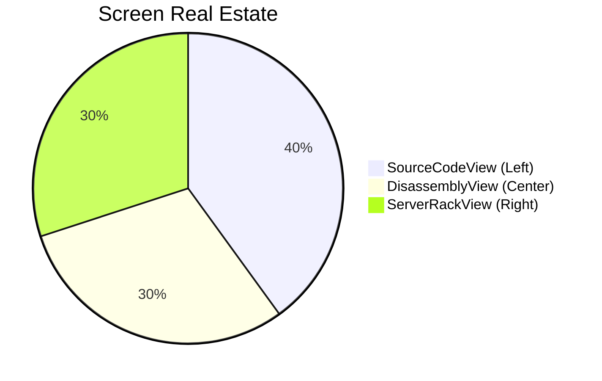

# 🎨 Interface & Layout Manual

> **Last updated: v0.6.0**

GridLock's interface is designed for maximum data density and minimal context switching. It revolves around a primary **3-Column QSplitter Layout** and a comprehensive set of **Bottom Docks**.

## 📐 The 3-Column QSplitter Layout

GridLock partitions the main viewing area into three synchronized columns.



*   **Left Column: `SourceCodeView`**
    Your primary text editor. Features LSP-powered syntax highlighting, inline hover tooltips, and logical block-based breakpoint tracking to prevent execution drift.
*   **Center Column: `DisassemblyView`**
    A synchronized assembly view. As you step through C++ code on the left, the DisassemblyView highlights the corresponding machine instructions, crucial for vectorization and optimization analysis.
*   **Right Column: `ServerRackView`**
    A visual matrix of all active MPI ranks. Instantly see which ranks are running, paused, or crashed.

---

## 🗃️ Bottom Docks (`QTabWidget`)

The lower portion of the screen houses auxiliary tools in a tabbed interface.

| Dock | Functionality |
| :--- | :--- |
| **Terminal** *(v0.6.0)* | Fully interactive embedded shell powered by `qtermwidget`. Provides a real PTY session — run arbitrary shell commands without leaving the IDE. |
| **Watch Expressions** | Track specific variables across all or specific MPI ranks. |
| **Evaluator** | Execute ad-hoc GDB/MI expressions instantly. |
| **Reference Manual** | Integrated dual-mode Zeal/SQLite docsets and `man` pages. |
| **GDB Console** | Raw access to the underlying GDB instance with rank/text filtering. |
| **MemView** | Hex dumps and raw memory analysis via `process_vm_readv`. |
| **Registers** | Real-time CPU register state, synchronized with the execution line. |
| **HPC Console** | Management for SSH connections and cluster state. |
| **MPI Diagnostics** | High-level MPI communicator and topology breakdown. |
| **Network Log** *(v0.6.0)* | **Read-only** capture of raw DAP/GDB stdout from the active debug session. Found inside the **MPI Diagnostics** panel. Replaces the old "Network Log" tab from the pseudo-terminal. |

> [!NOTE]
> The **Terminal** and **Network Log** docks replaced the old monolithic pseudo-terminal introduced in v0.5.x. If you are upgrading from an earlier version, the old "Terminal" tab now maps to the fully interactive `TerminalDockWidget`, while DAP/GDB output previously mixed into that tab now streams exclusively to the **Network Log**.

---

## ⌨️ Vim-Style Chorded Shortcuts

GridLock embraces a keyboard-centric philosophy using a global ShortcutManager.

| Chord / Shortcut | Action | Scope |
| :--- | :--- | :--- |
| `Alt + B` | Toggle Breakpoint at Cursor | `SourceCodeView` |
| `Ctrl + W`, `H` | Focus Left Split | Global |
| `Ctrl + W`, `L` | Focus Right Split | Global |
| `Ctrl + W`, `J` | Focus Bottom Docks | Global |
| `Ctrl + W`, `K` | Focus Top Split | Global |
| `F5` | Start / Continue Execution | Global |
| `F10` | Step Over | Global |
| `F11` | Step Into | Global |
| `Shift + F11` | Step Out | Global |
| `Alt + R` | Focus ServerRackView | Global |

> [!TIP]
> All shortcuts are intercepted globally but safely bypass input fields to ensure you never accidentally trigger a command while typing a variable name.

---

## 🎨 Customizing Appearance

GridLock uses a unified Material Design theming engine powered by `Qt-Advanced-Stylesheets`.
To customize your visual experience, open the **Preferences** dialog (`Edit -> Preferences` or `Ctrl+Comma`) and navigate to the **Appearance** tab:

* **File Tree Density:** Choose between *Compact*, *Comfortable*, or *Large* layouts for the Project Explorer.
* **Colorize Icons:** Toggle this to enable/disable vibrant Nerd Font icons based on the Catppuccin Mocha color palette.

These settings are applied instantly upon saving without requiring an application restart.

---

## 📂 Project-Local Configuration (v0.6.0)

GridLock supports **project-scoped configuration overrides** via a `.gridlock/` directory at the root of your workspace. This directory is checked on every session load and takes precedence over your global user configuration.

### Setting Up Project-Local Settings

1. Create a `.gridlock/` directory in your project root:
   ```bash
   mkdir -p /path/to/my-project/.gridlock
   ```

2. Create a `workspace.toml` file inside it. Any key present here will override the matching key from `~/.config/gridlock/config.toml`:
   ```toml
   # .gridlock/workspace.toml
   # Project-specific overrides — safe to commit to source control

   [debugger]
   lldb_dap_path = "/opt/llvm-17/bin/lldb-dap"  # pin a specific toolchain version

   [mpi]
   rank_count   = 8
   launch_args  = "--bind-to core --map-by node"

   [workspace]
   binary_path  = "build/my_sim"
   working_dir  = "build/"
   ```

3. Reload the session (or reopen the project) for changes to take effect.

> [!TIP]
> You can safely commit `.gridlock/workspace.toml` to source control. It contains no secrets — only paths and arguments. Global secrets (like SSH keys or API tokens) should remain in `~/.config/gridlock/config.toml`.

---

## 💾 Persistent Memory: Wizard Fields & Dock Layout (v0.6.0)

GridLock now remembers your workspace state between sessions automatically — no manual saving required.

### Project Wizard Auto-Population

When you open **File → New Project** (or the **Project Wizard**), all fields are pre-filled with the values from the last time you used the wizard:

* Binary path
* Working directory
* MPI argument string
* Rank count

This eliminates the need to re-enter configuration details for repeated use cases.

### Dock Layout Restoration

GridLock saves the **full dock widget layout** (positions, sizes, floating states, and tab order) when you close the application. On the next launch, the layout is fully restored to exactly where you left it.

* Layout state is persisted automatically via `QSettings` on close.
* No additional action is required — this is always active.
* To **reset** the layout to the default, use **View → Reset Layout** (or delete the `[Layout]` section from `~/.config/gridlock/config.toml`).
